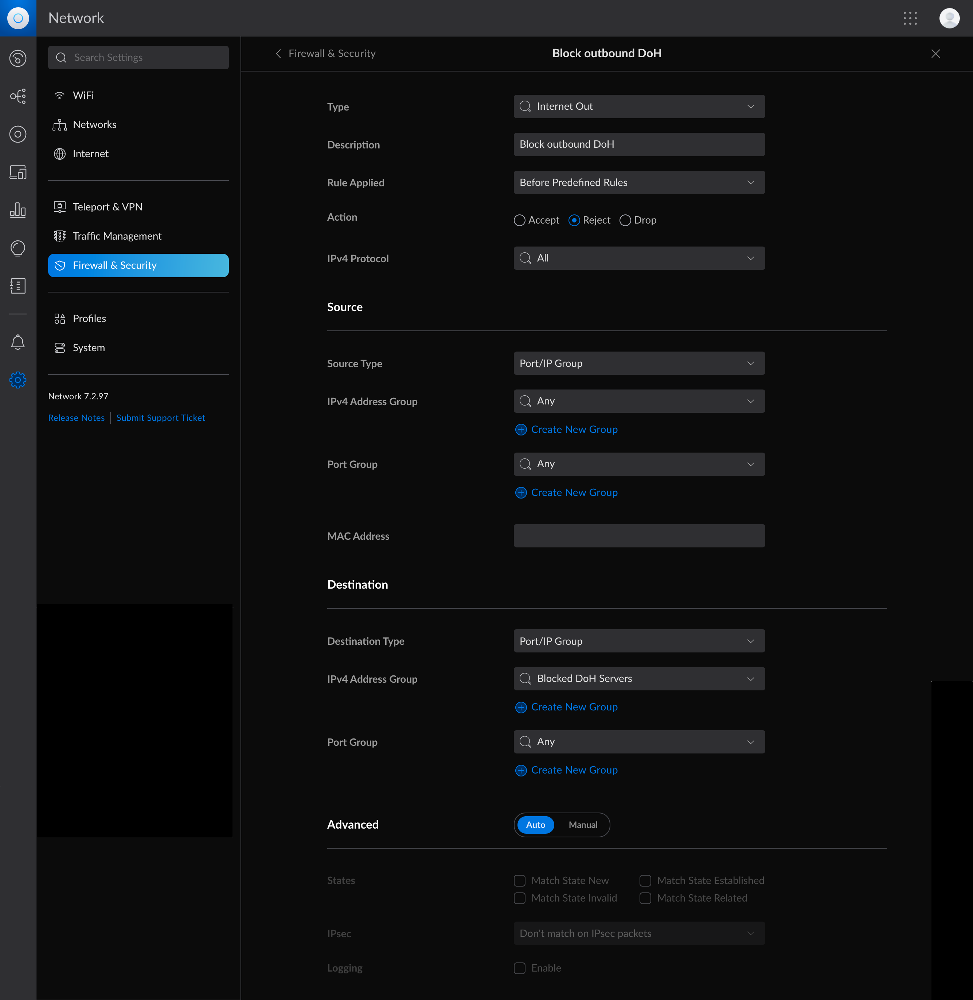

unifi-doh-blocker
=================

Patrick Wagstrom &lt;160672+pridkett@users.noreply.github.com&gt;

February 2023

Overview
--------

This is part of my continuing process of ensuring that systems can't reach out and get hostnames unless I expressly permit them to do that. Basically, it really clamps down on devices relaying information back to their mothership or being able to serve ads. It's become particularly nasty now that some devices have hardcoded `8.8.8.8`/`dns.google` as DNS-over-HTTPS servers - renderign my blocks on port 53/853 useless.

The only way that I've found I can easily do this is to create a group within my Unifi controller, and then block all DNS-over-HTTPS traffic every DNS-over-HTTPS servers that you want to block. This program does that for me.

It is almost certainly overkill.

Installation
------------

```bash
go build
```

Usage
-----

This program doesn't have a lot of command line options, instead most everything is configured via a TOML based configuration file.

```bash
./unifi-doh-blocker -h
Usage of ./unifi-doh-blocker:
  -config string
    	config file (default "config.toml")
```

The configuration file is pretty simple, here's an example you can use:

```toml
[input]
lists = [ "https://raw.githubusercontent.com/crypt0rr/public-doh-servers/main/dns.list" ]

[unifi]
host = "https://YOUR.UNIFI.HOST"
user = "LOCAL_ADMIN_USERNAME"
password = "LOCAL_ADMIN_PASSWORD"

[output]
groups = [
    { name="Blocked DoH Servers", type="ipv4" },
    { name="Blocked DoH Servers (IPv6)", type="ipv6" }
]
```

### `[input]`

This only has a single field right now `lists` which is a list of URLs or filenames that should be read in. This program doesn't have to be run that often, so you should generally be fine with a set of remote lists. If an entry begins with `http` or `https`, it's treated as a remote URL, everything else is treated as a local file.

### `[unifi]`

This is the configuration for your Unifi controller. It might be a little hard-coded to be a Unifi Dream Machine Pro right now (I think there are different login URLs for the different models). The key thing is that you need a local administrator account that does not have any form of 2FA enabled.

### `[output]`

This specifies the Unifi firewall groups that should be modified. Right now the program requires that these groups exist, so create them in the GUI first. Each object needs two fields, the `name` of the group and a `type` variable which is either `ipv4` or `ipv6`. Right now these lists are completely overwritten and you can only have one of each kind of list.

Applying the Rules
------------------

If you're just trying to block DNS-over-HTTPS traffic from all hosts, you'll want to create an outbound `reject` rule that applies to any address and any port for the source and applies to the `Blocked DoH Servers` group and any port for the destination. Here's a screenshot of how I did it on my Unifi Dream Machine Pro:



You can then test the rule with the following commands (provided that Cloudflare's DNS-over-HTTPS server is included in your list of hosts to block):

```bash
# this command should return your external IP address
curl https://ifconfig.me
# this command will fail with "curl: (6) Couldn't resolve host name"
curl --doh-url https://cloudflare-dns.com/dns-query https://ifconfig.me
```

License
-------

This project is licensed under the MIT License - see the [LICENSE](LICENSE) file for details

Acknowledgments
---------------

* [Unifi API](https://ubntwiki.com/products/software/unifi-controller/api): This provided the start for being able reverse engineer the REST interface required for the project.

